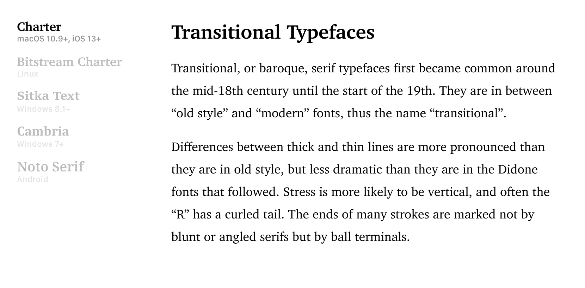

<p align="center">
  <a href="https://modernfontstacks.com/">
    
  </a>
</p>

<h1 align="center">Modern Font Stacks</h1>
<h3 align="center">Progressive system font stacks, organized by typeface classification</h3>

You may not need Google Fonts or web fonts. No CLS, no jank, no KBs — instant renders.

<br>

## Transitional

Transitional typefaces are a mix between Old Style and Modern typefaces that was developed during The Enlightenment. Baskerville and Times New Roman are common examples of Transitional serifs.

#### CSS Font Stack
```css
font-family: Charter, 'Bitstream Charter', 'Sitka Text', Cambria, serif;
```

 

<details>
<summary><strong>🎥 Preview Rendering</strong></summary>

</details>

<details>
<summary><strong>✅ Font Weights & Notes</strong></summary>


#### Supported Font Weights

| Font Weights          | 100 | 200 | 300 | 400 | 500 | 600 | 700 | 800 | 900 |
|:----------------------|:---:|:---:|:---:|:---:|:---:|:---:|:---:|:---:|:---:|
| Charter               |     |     |     |  ●  |     |     |  ●  |     |  ●  |
| Bitstream Charter     |     |     |     |  ●  |     |     |  ●  |     |     |
| Sitka Text            |     |     |     |  ●  |     |     |  ●  |     |     |
| Cambria               |     |     |     |  ●  |     |     |  ●  |     |     |
| Noto Serif¹           |     |     |     |  ●  |     |     |  ●  |     |     |


#### Notes
- Charter is a timeless typeface designed by Matthew Carter in 1987 for low-resolution 300dpi fax machines and laser printers. It has a large x-height helping with readability, and holds up on today's screens.
- Sitka is another typeface designed by Matthew Carter that slightly resembles Charter. Sitka was designed in collaboration Microsoft's Advanced Reading Technologies to optimize readability.
- Android uses Noto Serif as its default `serif` font, so no need to specify in the stack.
- ¹Noto Serif may have all font weights depending on the linux distro.

</details>


<br>

## Additional Features

#### Emoji Support

Looking to add native emojis to your page? Append these fonts at the end of your font stack:

```css
'Apple Color Emoji', 'Segoe UI Emoji', 'Segoe UI Symbol', 'Noto Color Emoji'
```

#### Anti-Aliasing

Render your text with anti-aliasing by using these CSS properties:

```css
html {
  -webkit-font-smoothing: antialiased;
  -moz-osx-font-smoothing: grayscale;
}
```

<br>

## Operating System Support
- Windows 7 or newer
- Android 10 or newer
- iOS 9.3 or newer
- macOS 10.9 (Mavericks) or newer
- Linux
