<p align="center">
  <a href="https://modernfontstacks.com/">
    
  </a>
</p>

<h1 align="center">Modern Font Stacks</h1>
<h3 align="center">System font stack CSS organized by typeface classification for every modern OS</h3>

<p align="center">The fastest fonts available. No downloading, no layout shifts, no&nbsp;flashes — just instant&nbsp;renders.</p>

<br>
<hr>
<p align="center">
  <a href="#system-ui">System UI</a> &nbsp;&middot;&nbsp; 
  <a href="#transitional">Transitional</a> &nbsp;&middot;&nbsp; 
  <a href="#old-style">Old Style</a> &nbsp;&middot;&nbsp; 
  <a href="#humanist">Humanist</a> &nbsp;&middot;&nbsp; 
  <a href="#geometric-humanist">Geometric Humanist</a>
</p>
<p align="center">
  <a href="#classical-humanist">Classical Humanist</a> &nbsp;&middot;&nbsp; 
  <a href="#neo-grotesque">Neo-Grotesque</a> &nbsp;&middot;&nbsp; 
  <a href="#monospace-slab-serif">Monospace Slab Serif</a> &nbsp;&middot;&nbsp; 
  <a href="#monospace-code">Monospace Code</a>
</p>
<p align="center">
  <a href="#industrial">Industrial</a> &nbsp;&middot;&nbsp; 
  <a href="#rounded-sans">Rounded Sans</a> &nbsp;&middot;&nbsp; 
  <a href="#slab-serif">Slab Serif</a> &nbsp;&middot;&nbsp; 
  <a href="#antique">Antique</a> &nbsp;&middot;&nbsp; 
  <a href="#didone">Didone</a> &nbsp;&middot;&nbsp; 
  <a href="#handwritten">Handwritten</a>
</p>
<hr>

<br>

## System UI

System UI fonts are those native to the operating system interface. They are highly legible and easy to read at small sizes, contains many font weights, and is ideal for UI elements.

#### CSS Font Stack
```css
font-family: system-ui, sans-serif;
```

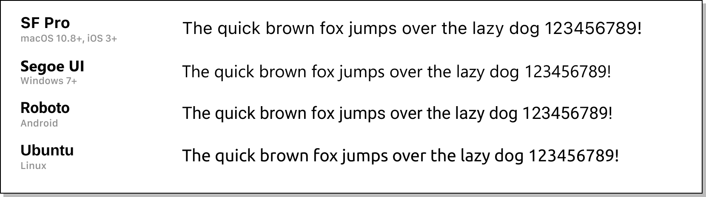

&nbsp; &nbsp;💻 **[View in Your Browser](https://modernfontstacks.com/?stack=system-ui) ([Article View](https://modernfontstacks.com/?stack=system-ui#article-view) / [Characters](https://modernfontstacks.com/?stack=system-ui#characters))**

<details>
<summary><strong>🎥 Preview Rendering Across Operating Systems</strong></summary>
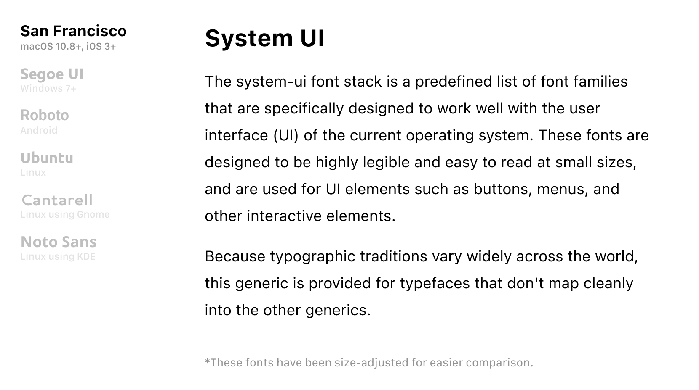
</details>

<details>
<summary><strong>✅ Font Weights & Notes</strong></summary>

<br>

| Font Weights          | 100 | 200 | 300 | 400 | 500 | 600 | 700 | 800 | 900 |
|:----------------------|:---:|:---:|:---:|:---:|:---:|:---:|:---:|:---:|:---:|
| San Francisco         |  ●  |  ●  |  ●  |  ●  |  ●  |  ●  |  ●  |  ●  |  ●  |
| Segoe UI              |  ●  |  ●  |  ●  |  ●  |  ●  |  ●  |  ●  |  ●  |  ●  |
| Roboto                |  ●  |  ●  |  ●  |  ●  |  ●  |  ●  |  ●  |  ●  |  ●  |
| Ubuntu                |  ●  |     |  ●  |  ●  |  ●  |     |  ●  |     |     |
| Cantarell             |  ●  |     |  ●  |  ●  |     |     |  ●  |  ●  |     |
| Noto Sans             |  ●  |  ●  |  ●  |  ●  |  ●  |  ●  |  ●  |  ●  |  ●  |

#### Notes
- System UI is less of a font stack and more of a CSS value, `system-ui`, representing the default user interface font. It is [widely supported](https://caniuse.com/font-family-system-ui) on all modern operating systems.
- The fonts shown are the default fonts for UI in each modern OS.

</details>

<p align="right"><a href="#modern-font-stacks">Back to Top ↑</a></p>


## Transitional

Transitional typefaces are a mix between Old Style and Modern typefaces that was developed during The Enlightenment. One of the most famous examples of a Transitional typeface is Times New Roman, which was developed for the Times of London newspaper.

#### CSS Font Stack
```css
font-family: Charter, 'Bitstream Charter', 'Sitka Text', Cambria, serif;
```

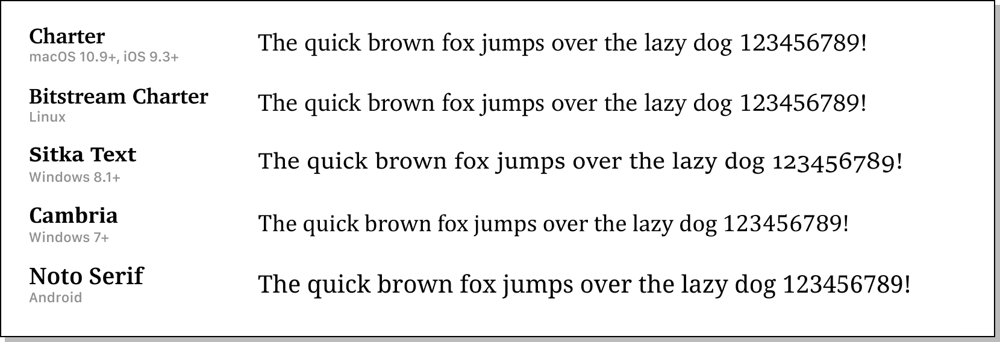

&nbsp; &nbsp;💻 **[View in Your Browser](https://modernfontstacks.com/?stack=transitional) ([Article View](https://modernfontstacks.com/?stack=transitional#article-view) / [Characters](https://modernfontstacks.com/?stack=transitional#characters))**

<details>
<summary><strong>🎥 Preview Rendering Across Operating Systems</strong></summary>
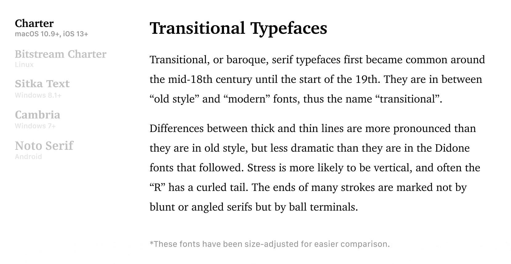
</details>

<details>
<summary><strong>✅ Font Weights & Notes</strong></summary>

<br>

| Font Weights          | 100 | 200 | 300 | 400 | 500 | 600 | 700 | 800 | 900 |
|:----------------------|:---:|:---:|:---:|:---:|:---:|:---:|:---:|:---:|:---:|
| Charter               |     |     |     |  ●  |     |     |  ●  |     |  ●  |
| Bitstream Charter     |     |     |     |  ●  |     |     |  ●  |     |     |
| Sitka Text            |     |     |     |  ●  |     |     |  ●  |     |     |
| Cambria               |     |     |     |  ●  |     |     |  ●  |     |     |
| Noto Serif¹           |     |     |     |  ●  |     |     |  ●  |     |     |


#### Notes
- [Charter](https://practicaltypography.com/charter.html) is a fantastic and timeless typeface designed by Matthew Carter in 1987 for low-resolution 300dpi fax machines and laser printers. It has a large x-height helping with readability, and holds up beautifully on today's screens.
- [Sitka](https://learn.microsoft.com/en-us/typography/font-list/sitka) is another beautiful typeface designed by Matthew Carter that slightly resembles Charter. Sitka was designed in collaboration [Microsoft's Advanced Reading Technologies](https://www.microsoft.com/en-us/research/uploads/prod/2021/06/Larson-Carter-2015-Sitka.pdf) to optimize readability.
- Android uses Noto Serif as its default `serif` font, so no need to specify in the stack.

</details>

<p align="right"><a href="#modern-font-stacks">Back to Top ↑</a></p>


## Old Style

Old Style typefaces are characterized by diagonal stress, low contrast between thick and thin strokes, and rounded serifs, and were developed in the Renaissance period. One of the most famous examples of an Old Style typeface is Garamond.

#### CSS Font Stack
```css
font-family: 'Iowan Old Style', 'Palatino Linotype', 'URW Palladio L', P052, serif;
```

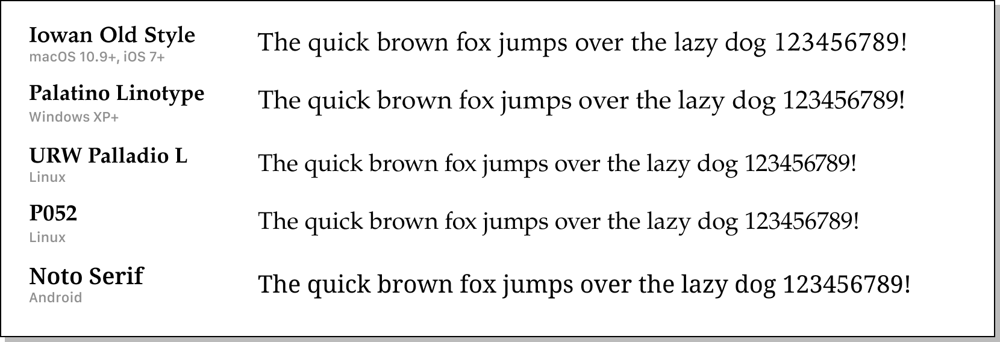

&nbsp; &nbsp;💻 **[View in Your Browser](https://modernfontstacks.com/?stack=old-style) ([Article View](https://modernfontstacks.com/?stack=old-style#article-view) / [Characters](https://modernfontstacks.com/?stack=old-style#characters))**

<details>
<summary><strong>🎥 Preview Rendering Across Operating Systems</strong></summary>
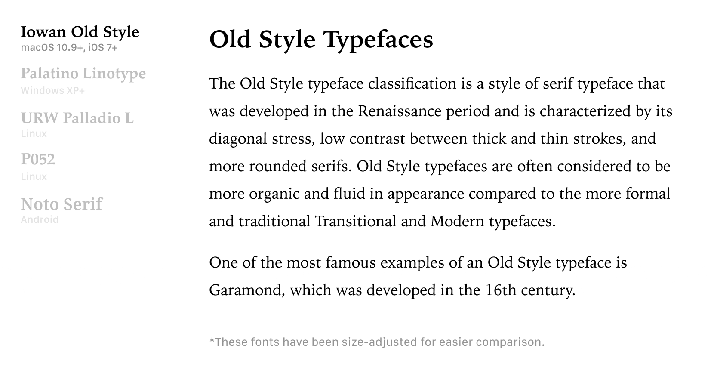
</details>

<details>
<summary><strong>✅ Font Weights & Notes</strong></summary>

<br>

| Font Weights          | 100 | 200 | 300 | 400 | 500 | 600 | 700 | 800 | 900 |
|:----------------------|:---:|:---:|:---:|:---:|:---:|:---:|:---:|:---:|:---:|
| Iowan Old Style       |     |     |     |  ●  |     |     |  ●  |     |  ●  |
| Palatino Linotype     |     |     |     |  ●  |     |     |  ●  |     |     |
| URW Palladio L        |     |     |     |  ●  |     |     |  ●  |     |     |
| P052                  |     |     |     |  ●  |     |     |  ●  |     |     |
| Noto Serif¹           |     |     |     |  ●  |     |     |  ●  |     |     |


#### Notes
- Android uses Noto Serif as its default `serif` font, so no need to specify in the stack.

</details>

<p align="right"><a href="#modern-font-stacks">Back to Top ↑</a></p>


## Humanist

Humanist typefaces are characterized by their organic, calligraphic forms and low contrast between thick and thin strokes. These typefaces are inspired by the handwriting of the Renaissance period and are often considered to be more legible and easier to read than other sans-serif typefaces.

#### CSS Font Stack
```css
font-family: Seravek, 'Gill Sans Nova', Ubuntu, Calibri, 'DejaVu Sans', source-sans-pro, sans-serif;
```

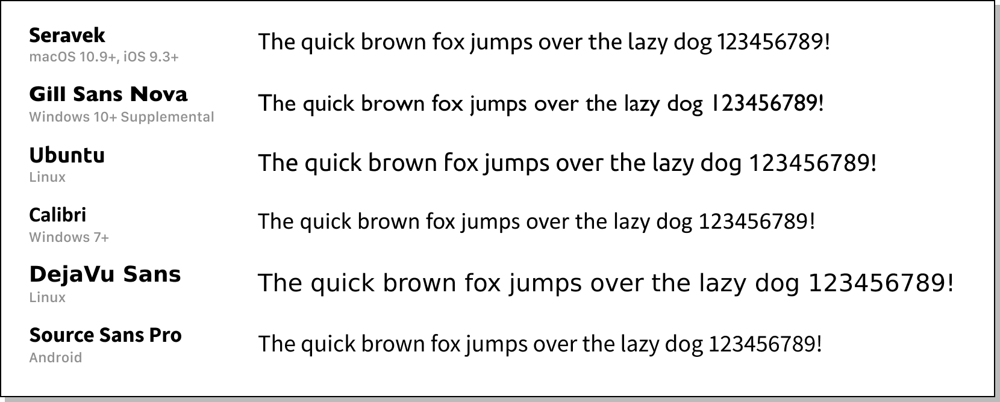

&nbsp; &nbsp;💻 **[View in Your Browser](https://modernfontstacks.com/?stack=humanist) ([Article View](https://modernfontstacks.com/?stack=humanist#article-view) / [Characters](https://modernfontstacks.com/?stack=humanist#characters))**

<details>
<summary><strong>🎥 Preview Rendering Across Operating Systems</strong></summary>
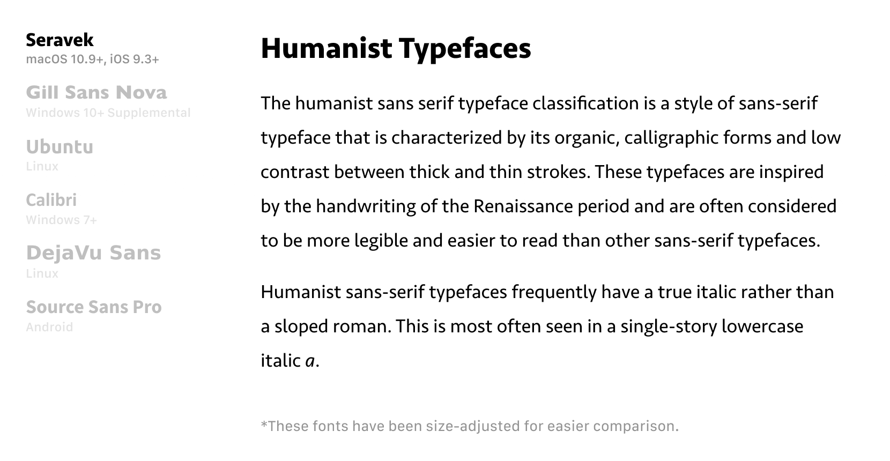
</details>

<details>
<summary><strong>✅ Font Weights & Notes</strong></summary>

<br>

| Font Weights          | 100 | 200 | 300 | 400 | 500 | 600 | 700 | 800 | 900 |
|:----------------------|:---:|:---:|:---:|:---:|:---:|:---:|:---:|:---:|:---:|
| Seravek               |     |  ●  |  ●  |  ●  |  ●  |     |  ●  |     |     |
| Gill Sans Nova        |     |     |  ●  |  ●  |     |     |  ●  |  ●  |     |
| Ubuntu                |  ●  |     |  ●  |  ●  |  ●  |     |  ●  |     |     |
| Calibri               |     |     |  ●  |  ●  |     |     |  ●  |     |     |
| DejaVu Sans           |  ●  |     |     |  ●  |     |     |  ●  |     |     |
| Source Sans Pro       |     |     |     |  ●  |     |  ●  |  ●  |     |     |

#### Notes
- [Gill Sans Nova](https://apps.microsoft.com/store/detail/gill-sans-nova/9PK93BG0Z1JJ) is available as a supplemental downloadable font.
- Source Sans Pro uses name [source-sans-pro](https://android.googlesource.com/platform/frameworks/base/+/master/data/fonts/fonts.xml#263) under Android, so this font only targets Android devices.

</details>

<p align="right"><a href="#modern-font-stacks">Back to Top ↑</a></p>


## Geometric Humanist

Geometric Humanist typefaces are characterized by their clean, geometric forms and uniform stroke widths. These typefaces are often considered to be modern and sleek in appearance, and are often used for headlines and other display purposes. Futura is a famous example of this classification.

#### CSS Font Stack
```css
font-family: Avenir, 'Avenir Next LT Pro', Montserrat, Corbel, 'URW Gothic', source-sans-pro, sans-serif;
```

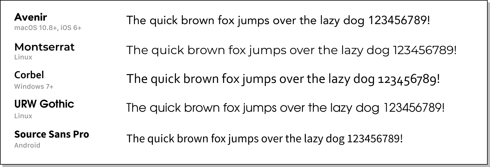

&nbsp; &nbsp;💻 **[View in Your Browser](https://modernfontstacks.com/?stack=geometric-humanist) ([Article View](https://modernfontstacks.com/?stack=geometric-humanist#article-view) / [Characters](https://modernfontstacks.com/?stack=geometric-humanist#characters))**


<details>
<summary><strong>🎥 Preview Rendering Across Operating Systems</strong></summary>
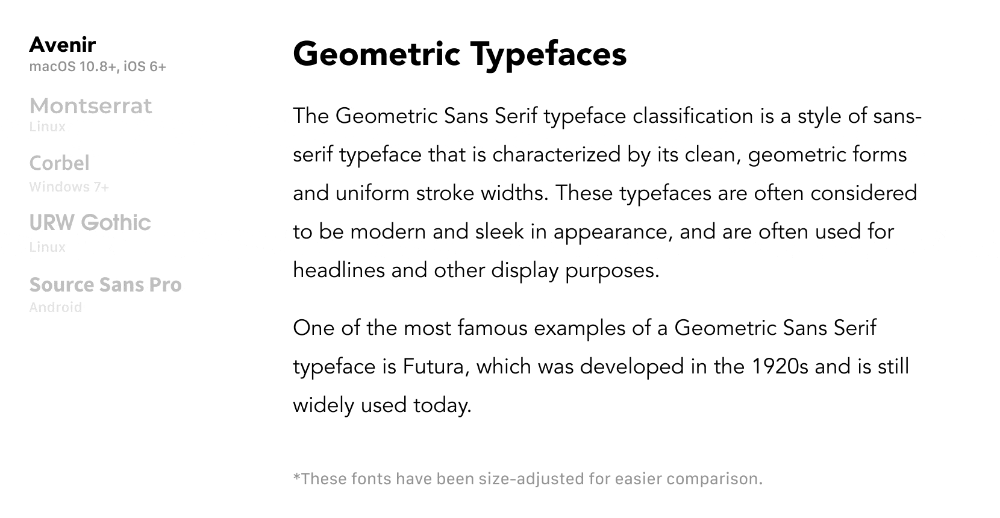
</details>

<details>
<summary><strong>✅ Font Weights & Notes</strong></summary>

<br>

| Font Weights          | 100 | 200 | 300 | 400 | 500 | 600 | 700 | 800 | 900 |
|:----------------------|:---:|:---:|:---:|:---:|:---:|:---:|:---:|:---:|:---:|
| Avenir                |     |     |  ●  |  ●  |  ●  |     |     |  ●  |  ●  |
| Avenir Next LT Pro    |     |     |  ●  |  ●  |     |     |  ●  |     |     |
| Montserrat            |  ●  |  ●  |  ●  |  ●  |  ●  |  ●  |  ●  |  ●  |  ●  |
| Corbel                |     |     |  ●  |  ●  |     |     |  ●  |     |     |
| URW Gothic            |     |     |  ●  |     |     |  ●  |     |     |     |
| Source Sans Pro       |     |     |     |  ●  |     |  ●  |  ●  |     |     |

#### Notes
- Avenir was chosen over Avenir Next for macOS because the weight 300 is much more legible on the web over the 200 weight that Avenir Next has. If you're looking for an ultra-light or ultra-black, feel free to swap Avenir for Avenir Next.
- [Avenir Next LT Pro](https://learn.microsoft.com/en-us/typography/font-list/avenirnextltpro) is supplied with Microsoft Office products.
- Source Sans Pro uses name [source-sans-pro](https://android.googlesource.com/platform/frameworks/base/+/master/data/fonts/fonts.xml#263) under Android, so this font only targets Android devices.

</details>

<p align="right"><a href="#modern-font-stacks">Back to Top ↑</a></p>


## Classical Humanist

Classical Humanist typefaces are characterized by how the strokes subtly widen as they reach the stroke terminals without ending in a serif. These typefaces are inspired by classical Roman capitals and the stone-carving on Renaissance-period tombstones.

#### CSS Font Stack
```css
font-family: Optima, Candara, 'Noto Sans', source-sans-pro, sans-serif;
```

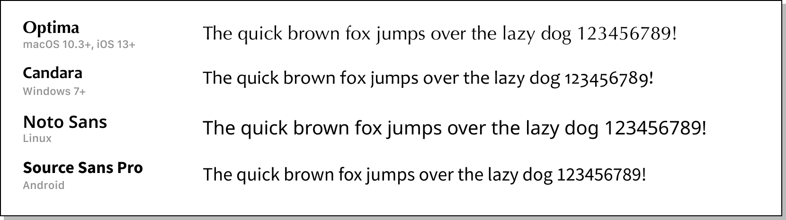


&nbsp; &nbsp;💻 **[View in Your Browser](https://modernfontstacks.com/?stack=classical-humanist) ([Article View](https://modernfontstacks.com/?stack=classical-humanist#article-view) / [Characters](https://modernfontstacks.com/?stack=classical-humanist#characters))**

<details>
<summary><strong>🎥 Preview Rendering Across Operating Systems</strong></summary>

</details>

<details>
<summary><strong>✅ Font Weights & Notes</strong></summary>

<br>

| Font Weights          | 100 | 200 | 300 | 400 | 500 | 600 | 700 | 800 | 900 |
|:----------------------|:---:|:---:|:---:|:---:|:---:|:---:|:---:|:---:|:---:|
| Optima                |     |     |     |  ●  |     |     |  ●  |     |  ●  |
| Candara               |     |     |  ●  |  ●  |     |     |  ●  |     |     |
| Noto Sans             |  ●  |  ●  |  ●  |  ●  |  ●  |  ●  |  ●  |  ●  |  ●  |
| Source Sans Pro       |     |     |     |  ●  |     |  ●  |  ●  |     |     |

#### Notes
- Source Sans Pro uses name [source-sans-pro](https://android.googlesource.com/platform/frameworks/base/+/master/data/fonts/fonts.xml#263) under Android, so this font only targets Android devices.

</details>

<p align="right"><a href="#modern-font-stacks">Back to Top ↑</a></p>


## Neo-Grotesque

Neo-Grotesque typefaces are a style of sans-serif that was developed in the late 19th and early 20th centuries and is characterized by its clean, geometric forms and uniform stroke widths. One of the most famous examples of a Neo-Grotesque typeface is Helvetica.

#### CSS Font Stack
```css
font-family: Inter, Roboto, 'Helvetica Neue', 'Arial Nova', 'Nimbus Sans', Arial, sans-serif;
```

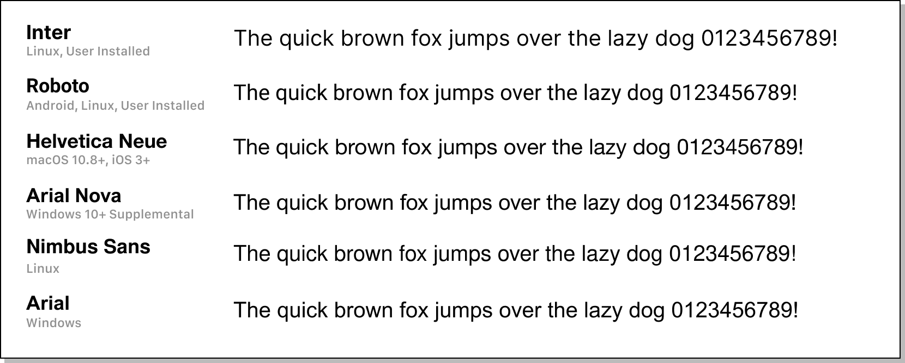

&nbsp; &nbsp;💻 **[View in Your Browser](https://modernfontstacks.com/?stack=neo-grotesque) ([Article View](https://modernfontstacks.com/?stack=neo-grotesque#article-view) / [Characters](https://modernfontstacks.com/?stack=neo-grotesque#characters))**

<details>
<summary><strong>🎥 Preview Rendering Across Operating Systems</strong></summary>
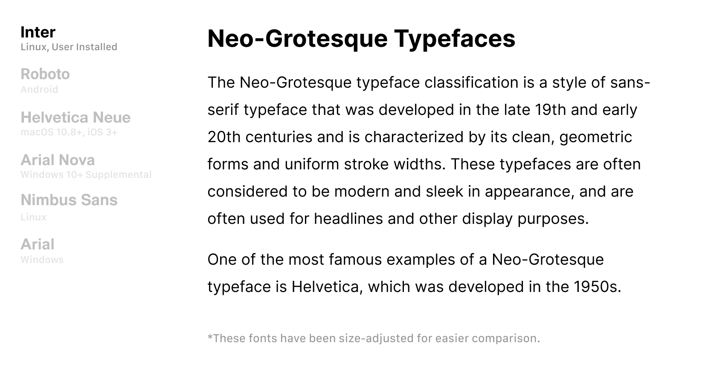
</details>

<details>
<summary><strong>✅ Font Weights & Notes</strong></summary>

<br>

| Font Weights          | 100 | 200 | 300 | 400 | 500 | 600 | 700 | 800 | 900 |
|:----------------------|:---:|:---:|:---:|:---:|:---:|:---:|:---:|:---:|:---:|
| Inter                 |  ●  |  ●  |  ●  |  ●  |  ●  |  ●  |  ●  |  ●  |  ●  |
| Roboto                |  ●  |  ●  |  ●  |  ●  |  ●  |  ●  |  ●  |  ●  |  ●  |
| Helvetica Neue        |  ●  |  ●  |  ●  |  ●  |  ●  |  ●  |  ●  |     |     |
| Arial Nova            |     |     |  ●  |  ●  |     |     |  ●  |     |     |
| Nimbus Sans           |     |     |     |  ●  |     |  ●  |  ●  |     |     |
| Arial                 |     |     |     |  ●  |     |  ●  |  ●  |     |     |

#### Notes
- [Arial Nova](https://apps.microsoft.com/store/detail/arial-nova/9NS5CT1MZ7M8) is available as a supplemental downloadable font.


</details>

<p align="right"><a href="#modern-font-stacks">Back to Top ↑</a></p>


## Monospace Slab Serif

Monospace Slab Serif typefaces are characterized by their fixed-width letters, which have the same width regardless of their shape, and its simple, geometric forms. Used to emulate typewriter output for reports, tabular work and technical documentation.

#### CSS Font Stack
```css
font-family: 'Nimbus Mono PS', 'Courier New', 'Cutive Mono', monospace;
```

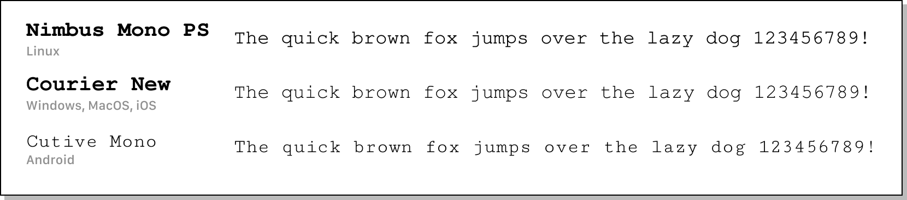

&nbsp; &nbsp;💻 **[View in Your Browser](https://modernfontstacks.com/?stack=monospace-slab-serif) ([Article View](https://modernfontstacks.com/?stack=monospace-slab-serif#article-view) / [Characters](https://modernfontstacks.com/?stack=monospace-slab-serif#characters))**

<details>
<summary><strong>🎥 Preview Rendering Across Operating Systems</strong></summary>
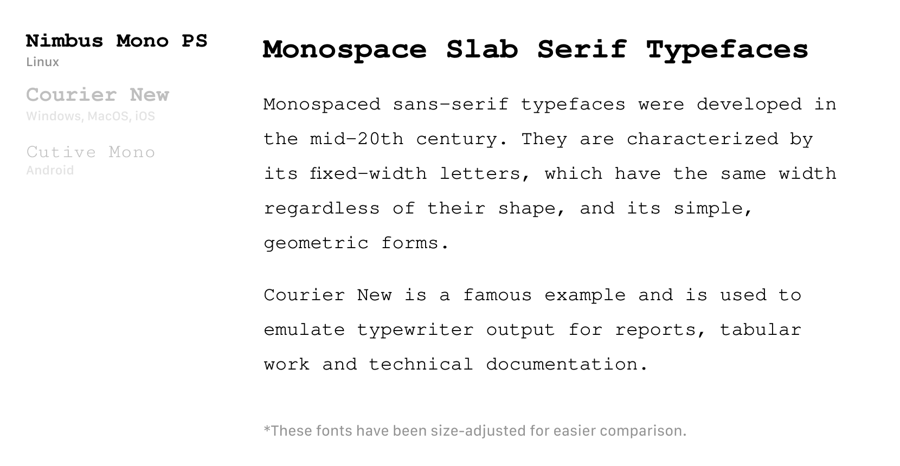
</details>

<details>
<summary><strong>✅ Font Weights & Notes</strong></summary>

<br>

| Font Weights          | 100 | 200 | 300 | 400 | 500 | 600 | 700 | 800 | 900 |
|:----------------------|:---:|:---:|:---:|:---:|:---:|:---:|:---:|:---:|:---:|
| Nimbus Mono PS        |     |     |     |  ●  |     |     |  ●  |     |     |
| Courier New           |     |     |     |  ●  |     |     |  ●  |     |     |
| Cutive Mono           |     |     |     |  ●  |     |     |     |     |     |

#### Notes
- Nimbus Mono PS is specified first because many Linux distros create name alias for Courier New and not always represent a slab serif
- Cutive Mono probably doesn't need to be prepresented in the stack as Android creates a name alias for Courier New.
- Cutive Mono unfortunately only has one weight


</details>

<p align="right"><a href="#modern-font-stacks">Back to Top ↑</a></p>


## Monospace Code

Monospace Code typefaces are specifically designed for use in programming and other technical applications. These typefaces are characterized by their monospaced design, which means that all letters and characters have the same width, and their clear, legible forms.


#### CSS Font Stack
```css
font-family: ui-monospace, 'Cascadia Code', 'Source Code Pro', Menlo, Consolas, 'DejaVu Sans Mono', monospace;
```

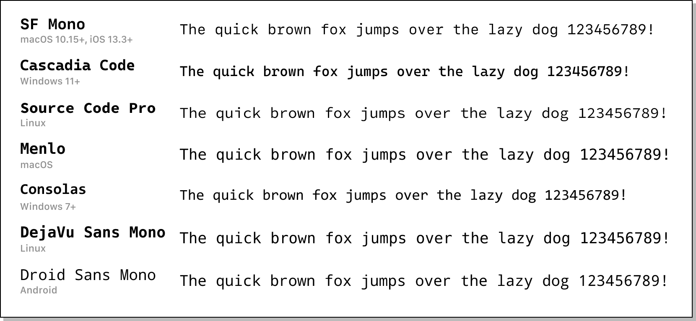

&nbsp; &nbsp;💻 **[View in Your Browser](https://modernfontstacks.com/?stack=monospace-code) ([Article View](https://modernfontstacks.com/?stack=monospace-code#article-view) / [Characters](https://modernfontstacks.com/?stack=monospace-code#characters))**

<details>
<summary><strong>🎥 Preview Rendering Across Operating Systems</strong></summary>
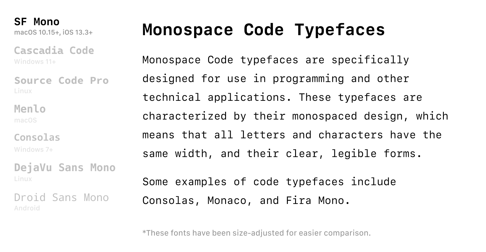
</details>

<details>
<summary><strong>✅ Font Weights & Notes</strong></summary>

<br>

| Font Weights          | 100 | 200 | 300 | 400 | 500 | 600 | 700 | 800 | 900 |
|:----------------------|:---:|:---:|:---:|:---:|:---:|:---:|:---:|:---:|:---:|
| SF Mono               |     |     |  ●  |  ●  |  ●  |  ●  |  ●  |  ●  |     |
| Cascadia Code         |  ●  |  ●  |  ●  |  ●  |     |  ●  |  ●  |     |     |
| Source Code Pro       |     |  ●  |  ●  |  ●  |  ●  |  ●  |  ●  |  ●  |     |
| Menlo                 |     |     |     |  ●  |     |     |  ●  |     |     |
| Consolas              |     |     |     |  ●  |     |     |  ●  |     |     |
| DejaVu Sans Mono      |     |     |     |  ●  |     |     |  ●  |     |     |
| Droid Sans Mono       |     |     |     |  ●  |     |     |     |     |     |

#### Notes
- SF Mono is [only available](https://caniuse.com/extended-system-fonts) via `ui-monospace` on macOS 10.15+ and iOS 13.3+ while using Safari
- Droid Sans Mono for Android does not need to be specified in the stack as `monospace` is a name alias for it

</details>

<p align="right"><a href="#modern-font-stacks">Back to Top ↑</a></p>


## Industrial

Industrial typefaces originated in the late 19th century and was heavily influenced by the advancements in technology and industry during that time. Industrial typefaces are characterized by their bold, sans-serif letterforms, simple and straightforward appearance, and the use of straight lines and geometric shapes. 


#### CSS Font Stack
```css
font-family: Bahnschrift, 'DIN Alternate', 'Franklin Gothic Medium', 'Nimbus Sans Narrow', sans-serif-condensed, sans-serif;
```

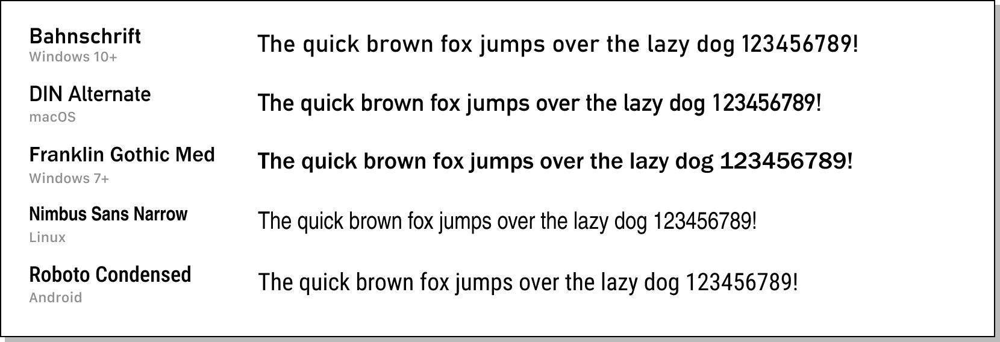

&nbsp; &nbsp;💻 **[View in Your Browser](https://modernfontstacks.com/?stack=industrial) ([Article View](https://modernfontstacks.com/?stack=industrial#article-view) / [Characters](https://modernfontstacks.com/?stack=industrial#characters))**

<details>
<summary><strong>🎥 Preview Rendering Across Operating Systems</strong></summary>
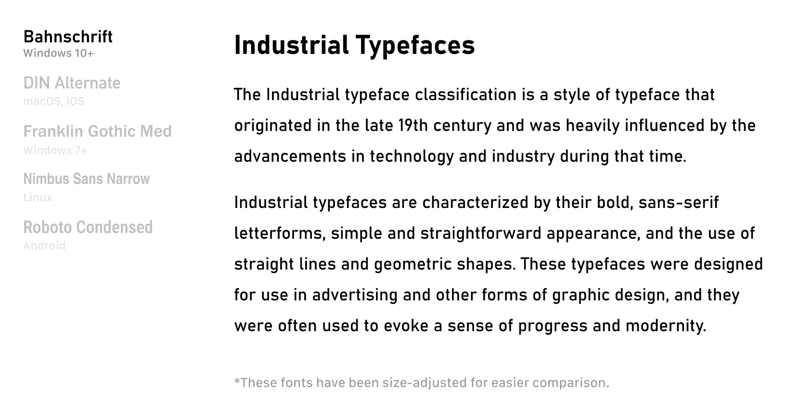
</details>

<details>
<summary><strong>✅ Font Weights & Notes</strong></summary>

<br>

| Font Weights            | 100 | 200 | 300 | 400 | 500 | 600 | 700 | 800 | 900 |
|:------------------------|:---:|:---:|:---:|:---:|:---:|:---:|:---:|:---:|:---:|
| Bahnschrift             |  ●  |  ●  |  ●  |  ●  |  ●  |  ●  |  ●  |  ●  |  ●  |
| DIN Alternate           |     |     |     |     |     |     |  ●  |     |     |
| Franklin Gothic Medium  |     |     |     |     |  ●  |     |     |     |     |
| Nimbus Sans Narrow      |     |     |     |  ●  |     |     |  ●  |     |     |
| Roboto Condensed        |  ●  |  ●  |  ●  |  ●  |  ●  |  ●  |  ●  |  ●  |  ●  |

#### Notes
- Since this stack is limited on weights across operating systems, it's best to use as a Medium/Bold display font
- Bahnschrift is one of the first [variable font](https://learn.microsoft.com/en-us/typography/font-list/bahnschrift) added to Windows.
- Roboto Condensed uses name [sans-serif-condensed](https://android.googlesource.com/platform/frameworks/base/+/master/data/fonts/fonts.xml#126) under Android, so this font only targets Android devices.

</details>

<p align="right"><a href="#modern-font-stacks">Back to Top ↑</a></p>


## Rounded Sans

Rounded typefaces are characterized by the rounded curved letterforms and give a softer, friendlier appearance. The rounded edges give the typeface a more organic and playful feel, making it suitable for use in informal or child-friendly designs. The rounded sans-serif style has been popular since the 1950s, and it continues to be widely used in advertising, branding, and other forms of graphic design.


#### CSS Font Stack
```css
font-family: ui-rounded, 'Hiragino Maru Gothic ProN', Quicksand, Comfortaa, Manjari, 'Arial Rounded MT Bold', Calibri, source-sans-pro, sans-serif;
```

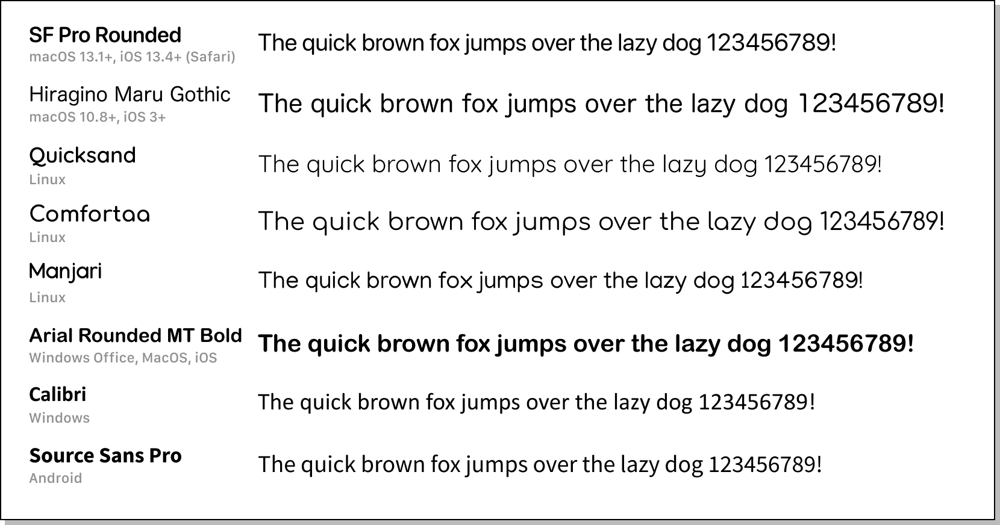

&nbsp; &nbsp;💻 **[View in Your Browser](https://modernfontstacks.com/?stack=rounded-sans) ([Article View](https://modernfontstacks.com/?stack=rounded-sans#article-view) / [Characters](https://modernfontstacks.com/?stack=rounded-sans#characters))**

<details>
<summary><strong>🎥 Preview Rendering Across Operating Systems</strong></summary>
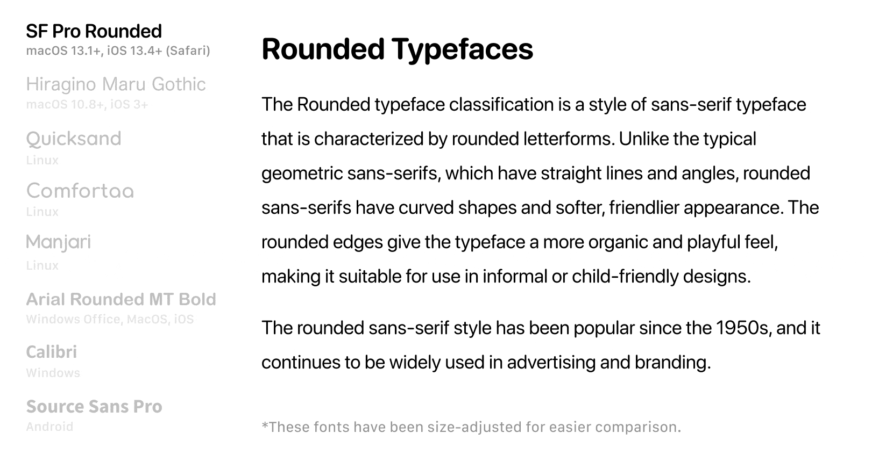
</details>

<details>
<summary><strong>✅ Font Weights & Notes</strong></summary>

<br>

| Font Weights            | 100 | 200 | 300 | 400 | 500 | 600 | 700 | 800 | 900 |
|:------------------------|:---:|:---:|:---:|:---:|:---:|:---:|:---:|:---:|:---:|
| SF Pro Rounded          |  ●  |  ●  |  ●  |  ●  |  ●  |  ●  |  ●  |  ●  |  ●  |
| Hiragino Maru Gothic    |     |     |     |  ●  |     |     |     |     |     |
| Quicksand               |     |     |  ●  |  ●  |     |     |  ●  |     |     |
| Comfortaa               |     |     |  ●  |  ●  |     |     |  ●  |     |     |
| Manjari                 |  ●  |     |     |  ●  |     |     |  ●  |     |     |
| Arial Rounded MT Bold   |     |     |     |     |     |     |  ●  |     |     |
| Calibri                 |     |     |  ●  |  ●  |     |     |  ●  |     |     |
| Source Sans Pro         |     |     |     |  ●  |     |  ●  |  ●  |     |     |

#### Notes
- SF Pro Rounded is [only available](https://caniuse.com/extended-system-fonts) via `ui-rounded` on macOS 10.15+ and iOS 13.3+ while using Safari
- Hiragino Maru Gothic is technically a Japanese typeface but has support for all the latin characters. The Mac font does not include a bold so a faux bold will be displayed on screen.
- Source Sans Pro uses name [source-sans-pro](https://android.googlesource.com/platform/frameworks/base/+/master/data/fonts/fonts.xml#263) under Android, so this font only targets Android devices. It's not a rounded typeface, but it's better than Roboto here.

</details>

<p align="right"><a href="#modern-font-stacks">Back to Top ↑</a></p>


## Slab Serif

Slab Serif typefaces are characterized by the presence of thick, block-like serifs on the ends of each letterform. These serifs are usually unbracketed, meaning they do not have any curved or tapered transitions to the main stroke of the letter.


#### CSS Font Stack
```css
font-family: Rockwell, 'Rockwell Nova', 'Roboto Slab', 'DejaVu Serif', 'Sitka Small', serif;
```

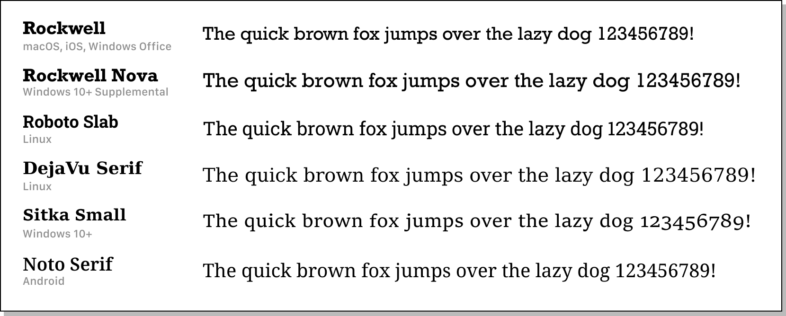

&nbsp; &nbsp;💻 **[View in Your Browser](https://modernfontstacks.com/?stack=slab-serif) ([Article View](https://modernfontstacks.com/?stack=slab-serif#article-view) / [Characters](https://modernfontstacks.com/?stack=slab-serif#characters))**

<details>
<summary><strong>🎥 Preview Rendering Across Operating Systems</strong></summary>
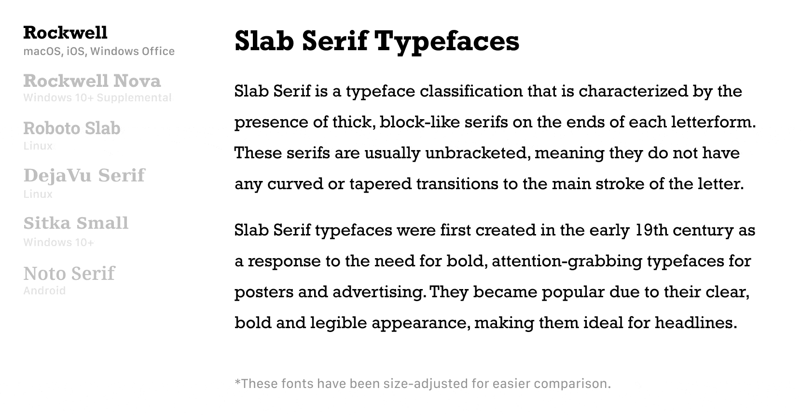
</details>

<details>
<summary><strong>✅ Font Weights & Notes</strong></summary>

<br>

| Font Weights            | 100 | 200 | 300 | 400 | 500 | 600 | 700 | 800 | 900 |
|:------------------------|:---:|:---:|:---:|:---:|:---:|:---:|:---:|:---:|:---:|
| Rockwell                |     |     |     |  ●  |     |     |  ●  |     |     |
| Rockwell Nova           |     |     |  ●  |  ●  |     |     |  ●  |  ●  |     |
| Roboto Slab             |  ●  |     |  ●  |  ●  |     |     |  ●  |     |     |
| DejaVu Serif            |     |     |     |  ●  |     |     |  ●  |     |     |
| Sitka Small             |     |     |     |  ●  |     |     |  ●  |     |     |
| Noto Serif              |     |     |     |  ●  |     |     |  ●  |     |     |


#### Notes
- [Rockwell](https://learn.microsoft.com/en-us/typography/font-list/rockwell) is included with Windows Office
- [Rockwell Nova](https://apps.microsoft.com/store/detail/arial-nova/9NS5CT1MZ7M8) is available as a supplemental downloadable font.
- Android uses Noto Serif as its default `serif` font, so no need to specify in the stack.

</details>

<p align="right"><a href="#modern-font-stacks">Back to Top ↑</a></p>


## Antique

Antique typefaces, also known as Egyptians, are a subset of serif typefaces that were popular in the 19th century. They are characterized by their block-like serifs and thick uniform stroke weight. 

#### CSS Font Stack
```css
font-family: Superclarendon, 'Bookman Old Style', 'URW Bookman', 'URW Bookman L', 'Georgia Pro', Georgia, serif;
```

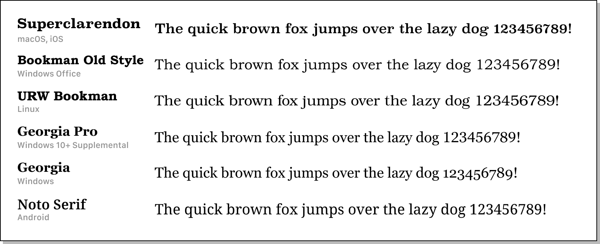

&nbsp; &nbsp;💻 **[View in Your Browser](https://modernfontstacks.com/?stack=antique) ([Article View](https://modernfontstacks.com/?stack=antique#article-view) / [Characters](https://modernfontstacks.com/?stack=antique#characters))**

<details>
<summary><strong>🎥 Preview Rendering Across Operating Systems</strong></summary>
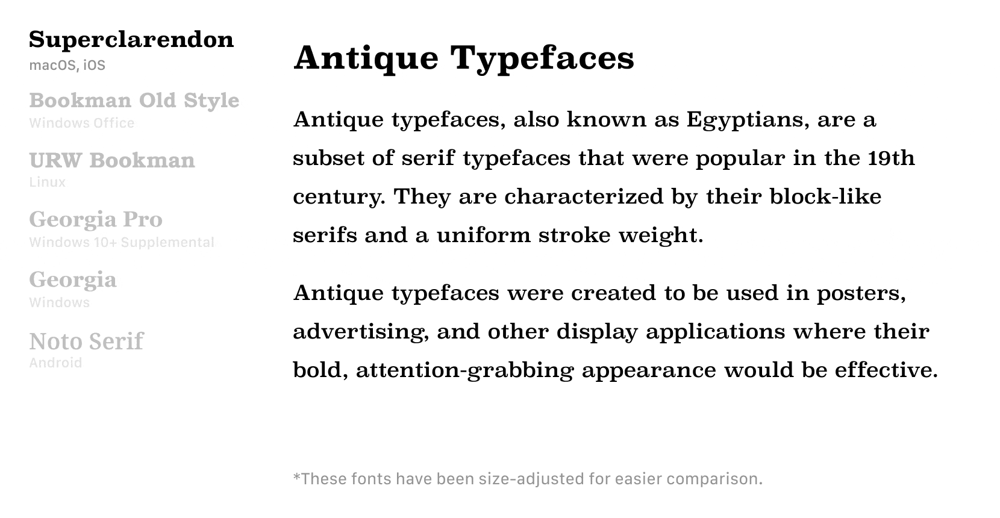
</details>

<details>
<summary><strong>✅ Font Weights & Notes</strong></summary>

<br>

| Font Weights            | 100 | 200 | 300 | 400 | 500 | 600 | 700 | 800 | 900 |
|:------------------------|:---:|:---:|:---:|:---:|:---:|:---:|:---:|:---:|:---:|
| Superclarendon          |     |     |  ●  |  ●  |     |     |  ●  |     |  ●  |
| Bookman Old Style       |     |     |     |  ●  |     |     |  ●  |     |     |
| URW Bookman             |     |     |  ●  |     |     |  ●  |     |     |     |
| Georgia Pro             |     |     |  ●  |  ●  |     |  ●  |  ●  |     |  ●  |
| Georgia                 |     |     |     |  ●  |     |     |  ●  |     |     |
| Noto Serif¹             |     |     |     |  ●  |     |     |  ●  |     |     |


#### Notes
- [Georigia Pro](https://apps.microsoft.com/store/detail/georgia-pro/9N9DZG1XT2MB) is available as a supplemental downloadable font.
- Android uses Noto Serif as alias for `Georgia`, so no need to specify in the stack.

</details>

<p align="right"><a href="#modern-font-stacks">Back to Top ↑</a></p>


## Didone

Didone typefaces, also known as Modern typefaces, are characterized by the high contrast between thick and thin strokes, vertical stress, and hairline serifs with no bracketing. The Didone style emerged in the late 18th century and gained popularity during the 19th century.


#### CSS Font Stack
```css
font-family: Didot, 'Bodoni MT', 'Noto Serif Display', 'URW Palladio L', P052, Sylfaen, serif;
```

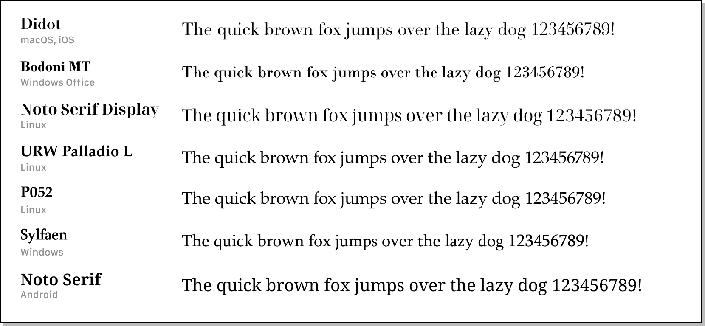

&nbsp; &nbsp;💻 **[View in Your Browser](https://modernfontstacks.com/?stack=didone) ([Article View](https://modernfontstacks.com/?stack=didone#article-view) / [Characters](https://modernfontstacks.com/?stack=didone#characters))**

<details>
<summary><strong>🎥 Preview Rendering Across Operating Systems</strong></summary>
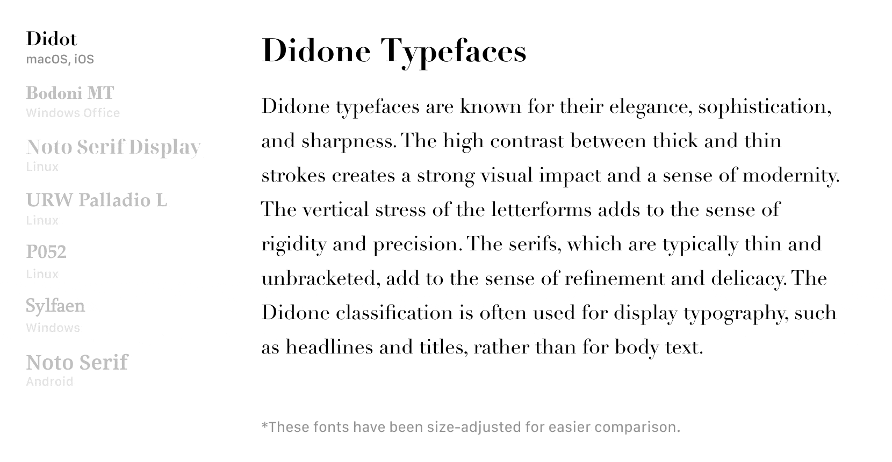
</details>

<details>
<summary><strong>✅ Font Weights & Notes</strong></summary>

<br>

| Font Weights            | 100 | 200 | 300 | 400 | 500 | 600 | 700 | 800 | 900 |
|:------------------------|:---:|:---:|:---:|:---:|:---:|:---:|:---:|:---:|:---:|
| Didot                   |     |     |     |  ●  |     |     |  ●  |     |     |
| Bodoni MT               |     |     |     |  ●  |     |     |  ●  |     |  ●  |
| Noto Serif Display      |  ●  |  ●  |  ●  |  ●  |  ●  |  ●  |  ●  |  ●  |  ●  |
| URW Palladio L          |     |     |     |  ●  |     |     |  ●  |     |     |
| P052                    |     |     |     |  ●  |     |     |  ●  |     |     |
| Sylfaen                 |     |     |     |  ●  |     |     |     |     |     |
| Noto Serif¹             |     |     |     |  ●  |     |     |  ●  |     |     |


#### Notes
- Android uses Noto Serif as its default `serif` font, so no need to specify in the stack.
- Sylfaen does not include a bold so a faux bold will be displayed on screen.

</details>

<p align="right"><a href="#modern-font-stacks">Back to Top ↑</a></p>


## Handwritten

Handwritten typefaces are designed to mimic the look and feel of handwriting. Despite the vast array of handwriting styles, this font stack tend to adopt a more informal and everyday style of handwriting.

#### CSS Font Stack
```css
font-family: 'Segoe Print', 'Bradley Hand', Chilanka, TSCu_Comic, casual, cursive;
```

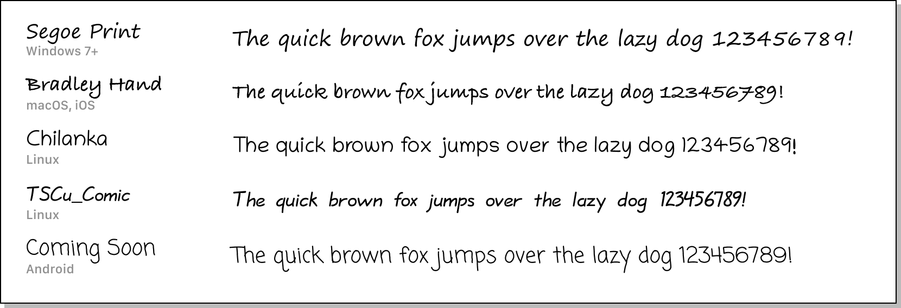

&nbsp; &nbsp;💻 **[View in Your Browser](https://modernfontstacks.com/?stack=handwritten) ([Article View](https://modernfontstacks.com/?stack=handwritten#article-view) / [Characters](https://modernfontstacks.com/?stack=handwritten#characters))**

<details>
<summary><strong>🎥 Preview Rendering Across Operating Systems</strong></summary>
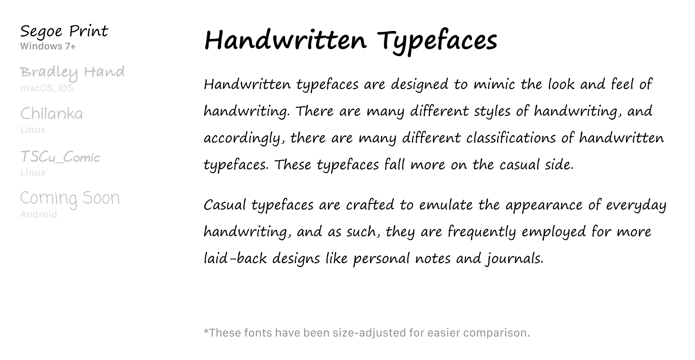
</details>

<details>
<summary><strong>✅ Font Weights & Notes</strong></summary>

<br>

| Font Weights            | 100 | 200 | 300 | 400 | 500 | 600 | 700 | 800 | 900 |
|:------------------------|:---:|:---:|:---:|:---:|:---:|:---:|:---:|:---:|:---:|
| Segoe Print             |     |     |     |  ●  |     |     |  ●  |     |     |
| Bradley Hand            |     |     |     |     |     |     |  ●  |     |     |
| Chilanka                |     |     |     |  ●  |     |     |     |     |     |
| TSCu_Comic              |     |     |     |  ●  |     |     |     |     |     |
| Coming Soon             |     |     |     |  ●  |     |     |     |     |     |


#### Notes
- Coming Soon uses name [casual](https://android.googlesource.com/platform/frameworks/base/+/master/data/fonts/fonts.xml#249) under Android, so this font only targets Android devices.

</details>

<p align="right"><a href="#modern-font-stacks">Back to Top ↑</a></p>


## Additional Features

#### Emoji Support

Looking to add native emojis to your page? Append these fonts at the end of your font stack:

```css
'Apple Color Emoji', 'Segoe UI Emoji', 'Segoe UI Symbol', 'Noto Color Emoji'
```

#### Anti-Aliasing

Render your text with anti-aliasing by using these CSS properties:

```css
html {
  -webkit-font-smoothing: antialiased;
  -moz-osx-font-smoothing: grayscale;
}
```

<br>

## Operating System Support
- [Windows 7 or newer](https://learn.microsoft.com/en-us/typography/fonts/windows_7_font_list)
- [Android 10 or newer](https://android.googlesource.com/platform/frameworks/base/+/master/data/fonts/fonts.xml) (Very limited with 8 fonts)
- [iOS 9.3 or newer](https://developer.apple.com/fonts/system-fonts/)
- [macOS 10.9 (Mavericks) or newer](https://support.apple.com/en-us/HT201375)
- [Linux](https://docs.google.com/spreadsheets/d/1kbxC3UyGTzpA9aOEJD-GYH0uHTops5VSEb8jKKD9Wwc/edit?usp=sharing) (Sampled 12 popular distros)

<p align="right"><a href="#modern-font-stacks">Back to Top ↑</a></p>
